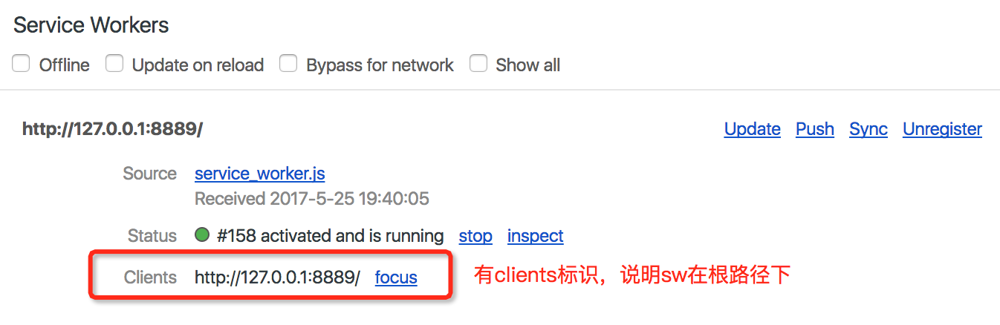
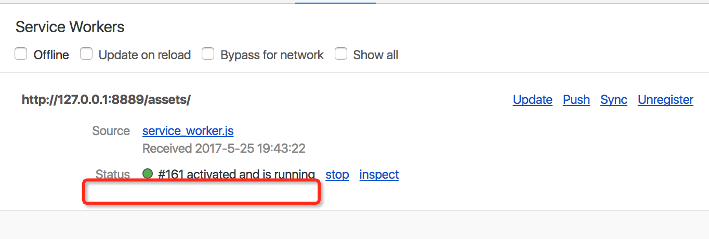

## PWA与ServiceWorker

- PWA开发中用到的技术
    - Service Worker
    - IndexedDB

- 使用serviceworker遇到的问题

    ServiceWorker脚本在服务器的文件位置会影响拦截的请求。如果sw放在服务器根目录，那么所有请求都会触发sw里监听的`fetch`事件，而如果放在了根目录以下的任何一个目录里，所有请求都拦截不到了。
    
    在google的ServiceWorker官方文档上看到，sw可以拦截所在位置同级及以下目录的资源，但是我测试是不行的，只能放在根目录才能拦截请求
    
    > register() 方法的精妙之处在于服务工作线程文件的位置。 您会发现在本例中服务工作线程文件位于根网域。 这意味着服务工作线程的作用域将是整个来源。 换句话说，服务工作线程将接收此网域上所有事项的 fetch 事件。 如果我们在 /example/sw.js 处注册服务工作线程文件，则服务工作线程将只能看到网址以 /example/ 开头（即 /example/page1/、/example/page2/）的页面的 fetch 事件。
    
    详情见[这篇文档](https://developers.google.com/web/fundamentals/getting-started/primers/service-workers)   
    
    提了一个[问题](https://stackoverflow.com/questions/44180631/fetch-not-fire-if-service-worker-not-located-in-servers-root-folder)，坐等答案
    
    另外，sw放在根目录下，chrome devtools的serviceworker panel上会有提示:
    
    - 在根目录下：
    
        
        
    - 不在根目录下：

        

- serviceworker生命周期
    
    
        
- serviceworker使用时序图

